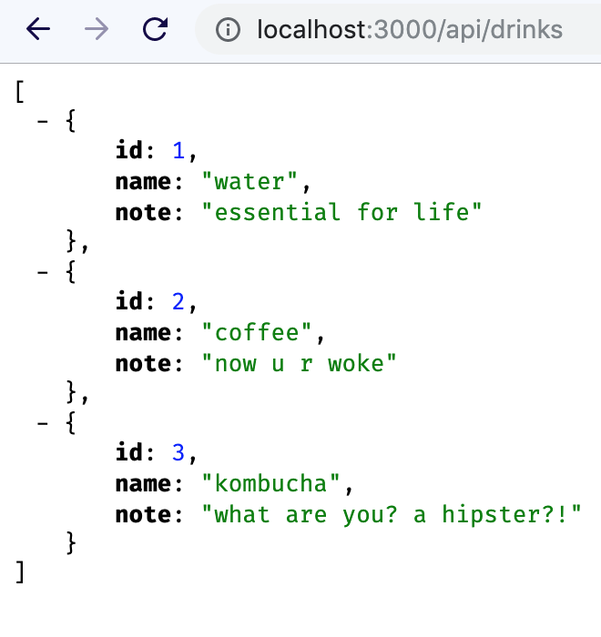
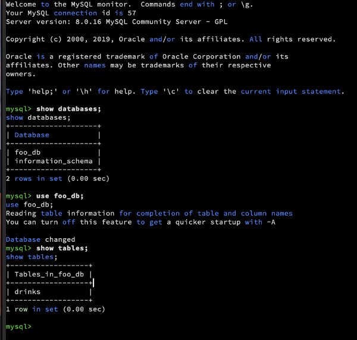
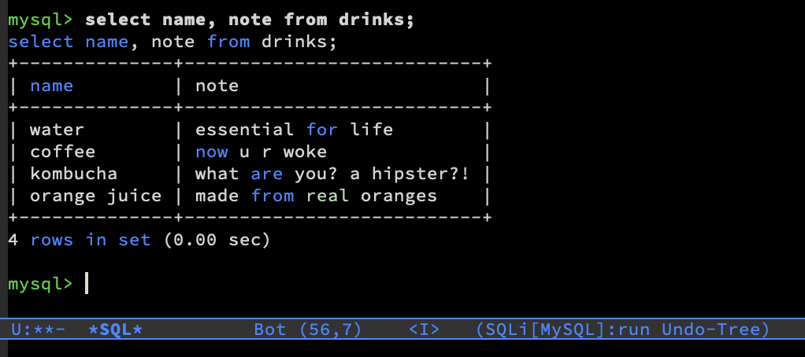
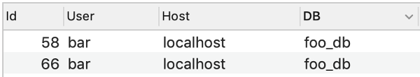

# Getting Started with MySQL

In this tutorial, we will set up a MySQL server and write a little
API using Node and Express. We'll then poke around and look at our
MySQL server using various tools (emacs and MySQLWorkbench).

## Setup

Download and install and install the [MySQL Community
Edition](https://dev.mysql.com/downloads/mysql/) server. 
I kept all the default options.

### Optional: MySQLWorkbench

For a nice GUI tool, download and install
[MySQL Workbench](https://www.mysql.com/products/workbench/).

### Command Line Tools

**Note:** These instructions assume you are using a UNIX based system (including
MacOS).

You may have to edit your `$PATH` environmental variable. Check that this is by
running:

```bash
echo $PATH
```

I added this line to my `.zshrc` file (I use `zsh`). If you use bash, you could
add the same line to your `.bashrc` file.

```bash
# path for MySQL
export PATH="/usr/local/mysql/bin:$PATH"
```

## Making a New User, Database, and Table

Run `mysql -u root -p` to log in to a MySQL shell as root. You will be prompted
for your password which you set during installation.

The following command will create a user `bar` with password `baz` on
`localhost`.

```sql
CREATE USER 'bar'@'localhost' IDENTIFIED BY 'baz';
```
Now, let's make a new database. The two commands below should be pretty 
self-explanatory.

```sql
CREATE DATABASE foo_db;
USE foo_db;
```

We will then give our new user all permissions to this particular database.

```sql
GRANT ALL PRIVILENGES ON foo_db.* TO 'bar'@'localhost';
```

Now, let's login and try to log in as our new user, `bar`. Type `\q` at the
`mysql>` prompt to quit. Then from your normal shell (e.g. bash), do:

```sql
mysql -u bar -p foo_db
```

You will then be prompted for your password (if you have been following this
tutorial, then that is `baz`). Type `show tables;` at the `mysql>` prompt. 

MySQL should return "Empty set", because you do not have any table(s) yet.

Let's change that. Run the following:

```sql
CREATE TABLE drinks (id INTEGER PRIMARY KEY, name VARCHAR(32), note VARCHAR(64)); 
```

Now try `show tables;` again. You should get something like this:

    +------------------+
    | Tables_in_foo_db |
    +------------------+
    | drinks           |
    +------------------+
    1 row in set (0.00 sec)

Wonderful! Now let's add a couple of items to this table.

```sql
INSERT INTO drinks(id, name, note)
VALUES(1, "water", "essential for life"),
      (2, "coffee", "now u r woke"),
      (3, "kombucha", "what are you? a hipster?!");
```

Now, (from the `mysql>` prompt) run `SELECT * FROM drinks;`. This should give
you output something like this:

    +----+----------+---------------------------+
    | id | name     | note                      |
    +----+----------+---------------------------+
    |  1 | water    | essential for life        |
    |  2 | coffee   | now u r woke              |
    |  3 | kombucha | what are you? a hipster?! |
    +----+----------+---------------------------+
    3 rows in set (0.00 sec)

## MySQL from Node

(Insert Node/npm install things)

Now that we have a user, a database, and a table we can start doing stuff these
things with JavaScript via Node. Let's write some Node code to query our
database. Create a file `index.js` with the following code:

```JavaScript
var mysql = require('mysql');
var connection = mysql.createConnection({
  host      : 'localhost',
  user      : 'bar',
  password  : 'baz',
  database  : 'foo_db',
  port      : 3306
});

connection.connect();

connection.query('SELECT * FROM drinks',
	             function (error, results, fields) {
  if (error) throw error;
  console.log(JSON.stringify(results)); // Output JSON as string to console 
});

connection.end()
```

Now, from the directory where you saved this file, run `node index.js`.

Assuming you've been following all of the previous steps, you should get output
something like this:

> [{"id":1,"name":"water","note":"essential for life"},{"id":2,"name":"coffee","note":"now u r woke"},{"id":3,"name":"kombucha","note":"what are you? a hipster?!"}]

### Troubleshooting `ER_NOT_SUPPORTED_AUTH_MODE`

Got this ^ error? 
Thanks, 
[stack overflow](https://stackoverflow.com/questions/44946270/er-not-supported-auth-mode-mysql-server) for this fix:

```sql
ALTER USER 'bar'@'localhost' IDENTIFIED WITH mysql_native_password BY 'baz';
```

## Making a Web Server

A plain string like the one we got above is OK, but we can do way
better. Let's create a web server that will return this (an API with
one endpoint).

```bash
npm install --save express
```

We are also going to need to install another package, `promise-mysql`,
because our new program will make use of **asynchronous**
code. Analagously to how we just installed `express`, do:

```bash
npm install --save promise sql
```

Now, replace the contents of `index.js` with this:

```javascript
var express = require('express');
var app = express();
var mysql = require('promise-mysql');

// Redirect root to our sole sole API endpoint
app.get('/', function(request, response) {
    response.redirect('/api/drinks');
});

// Uses Promise-based API
app.get('/api/drinks', function(request, response) {
    mysql.createConnection({
        host      : 'localhost',
        user      : 'bar',
        password  : 'baz',
        database  : 'foo_db',
        port      : 3306      // Default port for MySQL
    }).then(function(connection){
        var result = connection.query('SELECT * FROM drinks');
        connection.end();
        return result;
    }).then(function(rows){
        response.json(rows);
    });
});

app.listen(3000, function(){
    console.log("Listening on port 3000");
});

```

What blocky code! Run your (new) web server with `node index.js` from
the root directory and then navigate to
[http://localhost:3000](http://localhost:3000). Your web server should
return the same code JSON got in through the command line earlier.



My output, using the [JSONView](https://chrome.google.com/webstore/detail/jsonview/chklaanhfefbnpoihckbnefhakgolnmc?hl=en) Chrome extension.

## Doing Stuff From Emacs

Run `M-x sql-mysql` (this should be installed by default).  When
prompted for 'server' leave it blank as it should default to the
correct localhost setup.



(The theme here is n3mo's [Cyberpunk
Theme](https://github.com/n3mo/cyberpunk-theme.el). I tell you this
because I like this theme :P)

Now you can interact with your MySQL server from emacs. Try running
some SQL commands, e.g. `INSERT INTO drinks VALUES ...`. Note that SQL
key words aren't case sensitive and that emacs highlights keywords so
that they are easy do distinguish, even when typing in lowercase.



Make sure your server on [localhost:3000](http://localhost:3000) is
still running and refresh your browser. The results served in your
browser should reflect the updates to your MySQL server you just made
through emacs.

See [this blog
post](https://truongtx.me/2014/08/23/setup-emacs-as-an-sql-database-client)
by Truong TX for more information on interacting with SQL from emacs.

### Accessing our API

Lets install another thing in emacs: `M-x restclient`. This will allow
us to explore our webserve as a [REST
API](https://github.com/captainalan/REST-what).

Now, I will open a new buffer in `restclient-mode`. You can see the
file I used in this repo (`request.txt`). Put the cursor after all the
text and run `C-c C-c`. A new buffer should pop up with a nicely
formatted JSON response.

```json
[
  {
    "id": 1,
    "name": "water",
    "note": "essential for life"
  },
  {
    "id": 2,
    "name": "coffee",
    "note": "now u r woke"
  },
  {
    "id": 3,
    "name": "kombucha",
    "note": "what are you? a hipster?!"
  },
  {
    "id": 4,
    "name": "orange juice",
    "note": "made from real oranges"
  }
]
// GET http://localhost:3000/api/drinks
// HTTP/1.1 200 OK
// X-Powered-By: Express
// Content-Type: application/json; charset=utf-8
// Content-Length: 225
// ETag: W/"e1-9GYUrmF0mHF90BTTWiTvbswEy5M"
// Date: Tue, 21 May 2019 17:00:31 GMT
// Connection: keep-alive
// Request duration: 0.043737s
```

## Multiple Connections

(Open multiple connections at once...) 

We will now open MySQL workbench to see all the active connections.

You can see a list of supported languages 
[here](https://dev.mysql.com/doc/refman/8.0/en/connectors-apis.html).


